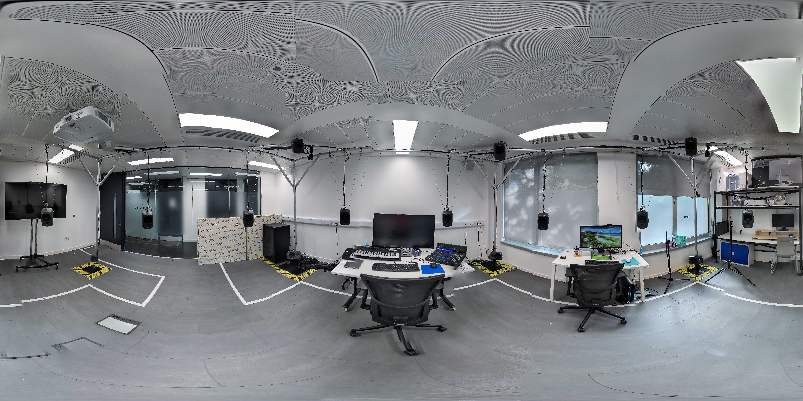

# SpatLab

Online guide and resources for working with spatial audio in RCA's Spatial Audio Lab (_SpatLab_) and at home.

[For information see the wiki](https://github.com/XRRCA/SpatLab/wiki)

For templates such as working with ambisonic audio at home go here: [template](templates/)
