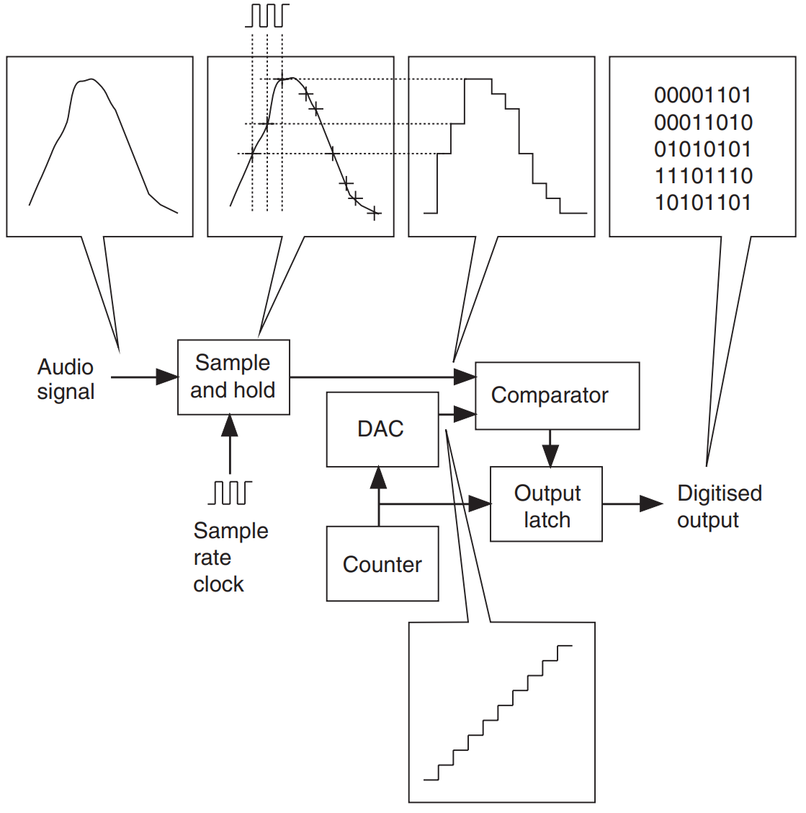
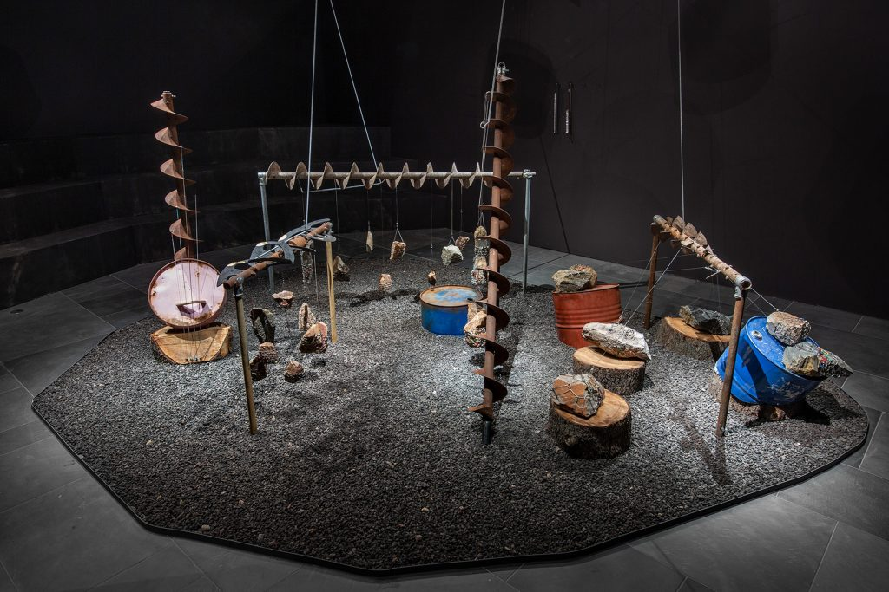

This part of the series contains the following, the format of the session is given in brackets:

* [Electroacoustic Composition and Sound Design](#electroacoustic-composition-sonic-arts-and-sound-design) – a short history of practice and concepts in experimental sound design.
* [Digital Audio Basics](#digital-audio-basics) - a quick review of what digital audio helps you understand software settings.
* [Audio Files](#audio-files) - a review of common audio formats.
* [Digital Audio Workstations (DAWs)](#digital-audio-workstations-daws) - this video highlights what a digital audio workstation is, and why they are used.
* [Introduction to Reaper and VSTs](#introduction-to-reaper-daw-and-vsts) – Reaper is the DAW that will be used for most of the series, VSTs are plugins to expand the sonic capabilities within DAWs.
* [Sound Synthesis, Home Recording, and Sampling](#sound-synthesis-field-recording-and-sampling) – A quick runthrough some methods of sound-making so that you can build a collection of sonic ingrediants for projects and compositions. 
* [Practice and Inspiration](#practice-and-inspiration) – for those new to audio, getting started is half the battle, this session introduces some DIY challenges to start producing content, intending to get you more familiar with tools like audio recording, Reaper, and VST instruments. (Workshops and meet-ups)

***

# Electroacoustic Composition, Sonic Arts, and Sound Design
Electroacoustic composition is the confluence of several streams: musique concrète, Elektronische Musik, computer music, soundscape work, etc. It is sometimes known as acousmatic music, after the legendary practices of the Pythagoreans of listening to lectures from behind screens, without visual reference-points.

[Link to Spotify Playlist](https://open.spotify.com/playlist/03VBkbiDhkS0EVoFoKSe06?si=6db6595e5dfc41e5)

## Background and History
Several different 'streams' or 'schools' are the antecedents of today's technologically-mediated music and sonic arts:

* Futurists c.1900s-1930s (Italy, Russia) - music and musical life to imitate/celebrate new technology.
* John Cage and Conceptualism c.1940s-1970s (USA) - liberation of noise and introduction of 'non-musical structures' into music.
* Musique Concrète c.1940/50s (France)- liberation of noise/everyday sounds helping to provide an alternative to Western Classical music's 'abstract music' project.
* Elektronische Musik c.1940/50s (Germany) - analogue technology for extension of Western Classical music's 'abstract  music' project, features include:
   * synthesis and.parametric control over tonal materials
* Computer music late 1950s (USA) - digital technology for extension of Western Classical music's 'abstract music' project, features include:
   * synthesis and enhanced parametric control over tonal materials
   * integrating compositional and textural control (e.g. algorithmic composition)
* Anything missing? [Brazilian modernists](https://www.bloomsbury.com/us/making-it-heard-9781501344435/), soundscape movement, dub, radiophonic workshop...

To give you some form of general definition, Electroacoustic music and sonic arts are a contemporary approach to composition. In its current form, the field owes much to the sonic  and conceptual explorations of John Cage, where artists investigation of sound goes beyond standard musical structures, incorporating broader ranges of environmentally-derived (and culturally-derived)  sound materials and experiences through technology. Defining characteristics are the use of exploratory sound processing (timbre  is the key structural domain of this music), sound synthesis, the presentation of 'fixed media' works in 'tape music' concerts, or, presentation over multiple loudspeakers (spatial arrays or ' loudspeaker orchestras ') where possible. Its materials and means may, however, cross over to other related areas of artistic practice: sound art and sound installations, digital/media  arts, popular electronic musics (EDM, glitch, ambient) and live electronic music performance, and composition for acoustic instruments and electronics.

## Further Materials
Discussion of curatorial issues in sound art installation at Hayward Gallery

Monoskop has a [section on Sonic Arts](https://monoskop.org/Sound_art) that will keep you occupied for a while!
### Some magazines
* [Sonic Field](https://sonicfield.org/)
* [Designing Sound](https://designingsound.org/)
### Record Shops
* [Boomkat](https://boomkat.com/), Online/Manchester
* [Underflow](http://www.underflow.gr/), Online/Greece
* Pyramid Records, San Francisco 
* [Wally’s Groove World](http://www.wallysgrooveworld.com/), Online/Antwerp
* Alan’s Record & CD Shop, 218 High Rd, London N2 9AY
* [Cafe OTO](https://www.cafeoto.co.uk/), [Online](https://www.cafeoto.co.uk/shop/)/London

## Reading
Augoyard, J.F. (1995) Sonic Experience: A Guide to Everyday Sounds. McGill-Queen's University Press

Cox, C. and D. Warner, ed. (2004) Audio Culture: Readings in Modern Music. London: Continuum

Demers, J. (2010) Listening Through the Noise: The Aesthetics of Experimental Electronic Music. New York: Oxford University Press

Emmerson S. (2007) Living Electronic Music. Aldershot: Ashgate

Eshun, K. (2020) More Brilliant Than the Sun: Adventures in Sonic Fiction. Verso Books

Gagood, M. (2019) Hush: Media and Sonic Self-Control. Duke University Press

Henriques, J. (2011) Sonic Bodies: Reggae Sound Systems, Performance Techniques, and Ways of Knowing. Bloomsbury

Holmes, T. (2012). Electronic and Experimental Music. London: Routledge

Hugill, A.(2008) The Digital Musician. London: Routledge

Landy, L. (2007). Understanding the Art of Sound Organisation. Cambridge: Cambridge University Press

Weheliye A. G. (2005) Phonographies: Grooves in Sonic Afro Modernity. Duke University Press [[link](https://www.goodreads.com/author/show/459722.Alexander_G_Weheliye)]

Witts, R. (1995) ‘Advice to Clever Children’ (aka ‘Stockhausen versus the Technocrats’), The Wire, Nov. 1995, available at: http://www.stockhausen.org/ksadvice.html

## Acknowledgements
Some information adapted from other sources, thanks go to:

Thomas Deacon, University of Surrey

[Brian Bridges, Ulster University](http://brianbridges.net/)

Matt Lewis, RCA

***

# Digital Audio Basics

Sound is a vibration in the air around us that we receive at our ears (and decode in our brains). Digital audio is simply ‘sound (accurately) described by numbers’. Digital audio is simply another means of encoding the air pressure vibration that is sound so that we can transmit or alter it.

This flow diagram shows how analogue signals are digitized to make digital audio signals.

Sampling is the process of changing the continuously varying (analogue) signal into a discrete set of digital readings (number values for specified time intervals). The process in the image above shows an audio signal being sampled at a regular rate: this reads off the size (amplitude) of the air pressure variation for each time interval. We then have numbers that embody a simplified representation of the original audio (depending on how accurate our sampling system is). Accuracy in sampling depends on two things: amplitude resolution (bit depth) and frequency resolution (sample rate). Common numbers for good quality recordings include:

Bit depth: 16, 24, 32

Sample Rate: 44.1 kHz, 48 kHz, 96kHz (kHz = kilo-Hertz, so at 48 kHz a signal is sampled 48000 times per second).

***

# Audio Files

There are many different digital audio file types out there, here we go over the main ones you would use when making spatial sound in the studio. One of the key things to pay attention to is whether you are using Lossy or Lossless audio files. 

## Lossy Audio Formats

With lossy files some of the audio data is discarded as the original recording is compressed. Lossy formats often get used by streaming services like Spotify, and they are the preferred format on iTunes. Their small file sizes make them easy to download or stream.

_Examples of lossy file types: AAC, MP3, OGG, WMA_

## Lossless Audio Formats

When recording and mixing, having the highest quality possible is ideal. With lossless file types all the sound information is preserved and stored. Lossless files give the highest quality possible, but they eat up your storage as you work.

_Examples of lossless file types: FLAC, ALAC, AIFF, WAV_

## Compatibility

As you being to make compositions using different files and systems you may run into issues where certain file types are not natively supported on the machine you are using, i.e. FLAC on Mac. So just be aware to check that the files you want to use are compatible with the hardware and software you will use in your workflow.

***

# Digital Audio Workstations (DAWs)

A Digital Audio Workstation (DAW) is a software application used for recording, editing, mixing, and producing digital audio. It is a comprehensive tool for music and audio production, combining a range of features such as multitrack recording, virtual instruments, MIDI sequencing, and audio effects processing.

In a DAW, users can record and manipulate multiple tracks of audio simultaneously, edit and arrange these tracks, add effects, and mix them down to a final stereo or multichannel mix. Digital Audio Workstations have become an essential tool for musicians, producers, and sound engineers, as they offer a high degree of flexibility and creative control over the music production process.

[You can watch this video to find out more about DAWs](https://www.youtube.com/watch?v=VJfMhuQYshA)

There are several popular Digital Audio Workstations available on the market, some of which include:

* [Pro Tools](https://www.avid.com/pro-tools?utm_campaign=pt_retier_q222--land&utm_source=google&utm_medium=paidsearch&utm_content=pt_main_sem&gclid=Cj0KCQjwuLShBhC_ARIsAFod4fIt0FPEHJGAMethpxF2r9-RpkcuDpBs0SJv3CBj0rv_rlPexmpLOEAaAqz3EALw_wcB): Developed by Avid, Pro Tools is a widely used DAW in the professional audio industry, known for its powerful editing and mixing capabilities.

* [Logic Pro](https://www.apple.com/uk/logic-pro/): Developed by Apple, Logic Pro is a DAW that is popular among musicians and producers, known for its intuitive interface and powerful MIDI sequencing features.

* [Ableton Live](https://www.ableton.com/en/): Ableton Live is a DAW that is popular among electronic music producers and performers, known for its unique Session View and real-time audio manipulation capabilities.

* [FL Studio](https://www.image-line.com/): Developed by Image-Line, FL Studio is a DAW that is popular among beatmakers and electronic music producers, known for its intuitive interface and powerful pattern-based sequencer.

* [Cubase](https://www.steinberg.net/cubase/): Developed by Steinberg, Cubase is a DAW that is popular among audio professionals, known for its powerful audio and MIDI editing capabilities.

* [Reaper](https://www.reaper.fm/): Reaper is a low-cost, yet powerful DAW, that is popular among audio professionals and hobbyists alike.

These are just a few examples of the many Digital Audio Workstations available, each with its own unique features and workflow.

_In SpatLab, we use _mostly_ use **Reaper** for working in **spatial audio formats such as Ambisonics**, but you can also work in **Pro Tools** and **Ableton**. You can potentially use **Logic** if you attach your macbook to the audio interface._

***

# Introduction to Reaper DAW and VSTs

## What is Reaper?

Reaper is a DAW that allows you record and mix audio, like band studio session, or, if you are working alone, playing back previous [recordings](https://www.musicgateway.com/blog/how-to/vocal-recording-101-how-to-record-vocals-for-beginners) while recording new tracks alongside them. The following video gives a comprehensive overview of basic Reaper features and acts as a jump start to using it with your own materials.

I recommend watching this [tutorial series on Reaper](https://www.youtube.com/watch?v=A0c-_YyuUts&list=PLM0xHqxaiT6-plorG47t3balft4nVki39) by Kenny Gioia.

## What is a VST?
All the essential plugins you need will come in just four general categories:

* **Virtual Instrument Plugins** – also called VSTi, these are plugins that emulate actual musical instruments. They come in a few different types: Samplers, Softsynths, Drum Machines. What these plugins do is emulate the sounds of a real live instrument in your DAW. You can “play” these virtual instruments using a midi controller/instrument, or you can write the notes into your piano roll using your mouse.
* **Effects Plugins** – sometimes referred to as Effects processors. Effects plugins are used to change or adjust the sound of the audio coming in and going out of your DAW. Generally speaking, but not always, effects processors work in the “time domain”, meaning, they alter the way the sound is perceived or produced within time, to produce the desired effect. Common ones include Reverbs and Delays,  Choruses, Flangers and Phasers.
* **Dynamics Plugins** – sometimes referred to as Dynamic processors. Dynamic plugins are dynamic processors that alter the amplitude of the audio signal to provide desired results. This means, the will either boost or cut parts of or whole frequency sections of an audio signal to change the way it sounds, or otherwise change the way the signal’s loudness is perceived. These include Equalizers (or EQ for short), Filters, Compressors and Limiters.

These videos and sound samples give some sonic context of the plugin types described above. Likewise, for VSTs, as individual bits of technology, check reviews on YouTube to understand what different plugins can do. 

## What else do I need to know to get started?

So now you know what a DAW is, Reaper is one of them, and what a VST is. With this, you can start making content for your projects, be that video sync or musical backing tracks. The following links cover important topics, incrementally introducing the extended feature sets of DAWs. Some fundamental ones to watch out for:
* [Setting up the software and your computer hardware](https://www.reaper.fm/videos.php#oTZsMG2rqMc)
* [MIDI Recording and Editing](https://www.reaper.fm/videos.php#3kY75JnmlNk)
* [Arrangement Editing](https://www.youtube.com/watch?v=cF-g6xrheb4&list=PLM0xHqxaiT6-plorG47t3balft4nVki39&index=6)
* [Envelopes and Automation](https://www.youtube.com/watch?v=EUEaStl4naI&list=PLM0xHqxaiT6-plorG47t3balft4nVki39&index=12)
* [Using audio effects creatively in Reaper](https://www.reaper.fm/videos.php#lFDv75U0nO0)
* [Working with Video in Reaper](https://www.reaper.fm/videos.php#-n0V_KnXbRA)

## External Resources

A comprehensive list of practice-based videos regarding Reaper can be found on the product website: https://www.reaper.fm/videos.php

Other tutorial resources can be found on YouTube, the key thing is to know the terms for the effects you want to achieve. So consulting some textbooks on audio and music production can help. [See this linked review of books regarding music production in 2023 for examples](https://blog.landr.com/music-production-books/) (the David Byrne one is really good!). If you are more into sound design check out these books available through the [RCA Library](https://library.rca.ac.uk/client/en_GB/summon/?)
* [Designing Sound: Andy Farnell, 2010](https://library.rca.ac.uk/client/en_GB/2015/search/detailnonmodal/ent:$002f$002fSD_ILS$002f0$002fSD_ILS:607349/ada)
* [Electronic music and sound design: Alessandro Cipriani & Maurizio Giri, 2016](https://library.rca.ac.uk/client/en_GB/2015/search/detailnonmodal/ent:$002f$002fSD_ILS$002f0$002fSD_ILS:115844/ada)
* [Generating Sound and Organizing Time, Graham Wakefield & Gregory Taylor, 2022](https://cycling74.com/books/go)

### Plugins

[See the resources section on plugins](Resources.md)

***

# Sound Synthesis, Field Recording and Sampling

## Synthesis

Sound synthesis is the process of creating sound electronically or digitally, either through hardware or software, using various techniques and algorithms. Sound synthesis involves creating complex waveforms or sound textures that can be manipulated to produce a wide variety of sounds, from simple sine waves to complex timbres that resemble real-world instruments.

There are several techniques used in sound synthesis, including [subtractive synthesis](https://en.wikipedia.org/wiki/Subtractive_synthesis), [additive synthesis](https://en.wikipedia.org/wiki/Additive_synthesis), [frequency modulation synthesis](https://en.wikipedia.org/wiki/Frequency_modulation_synthesis), [granular synthesis](https://en.wikipedia.org/wiki/Granular_synthesis), [wavetable synthesis](https://en.wikipedia.org/wiki/Wavetable_synthesis), and [physical modeling synthesis](https://en.wikipedia.org/wiki/Physical_modelling_synthesis). Each technique involves a different approach to creating and manipulating sound.

These videos outline the concepts above:
+ Overview video by [Simon Hutchingson](https://www.youtube.com/watch?v=np1XXoicgx8)
+ [Synth Fundementals](https://www.youtube.com/watch?v=NJLIS2MkFe4)
+ [Advanced Synthesis](https://www.youtube.com/watch?v=tlygYWeOzTg)

Sound synthesis is used extensively in music production, film and video game sound design, and other multimedia applications. It allows sound designers and musicians to create unique and expressive sounds that can be tailored to specific contexts and purposes.

List of some Sound Designers who you could look at:
+ [Brian Eno](https://www.youtube.com/watch?v=vNwYtllyt3Q) - an English musician and producer who is known for his pioneering work in ambient music, using techniques such as tape looping, sampling, and synthesis.
+ [Richard D. James (Aphex Twin)](https://www.youtube.com/watch?v=Xw5AiRVqfqk) - an English electronic musician and producer who is known for his innovative use of synthesis, including the creation of his own custom software instruments.
+ [Holly Herndon](https://www.youtube.com/watch?v=6baj34lxF4g) - an American composer and sound artist who is known for her work with voice processing and synthesis, and for her use of artificial intelligence and machine learning in her music.
+ [Winifred Phillips](https://www.youtube.com/watch?v=fKA4bnsTBl0) - an American composer and sound designer who has worked on many popular video game titles such as Assassin's Creed III, God of War, and LittleBigPlanet 2.

## Field Recording

Field recording is the practice of capturing sounds and audio in their natural environment, usually with a portable recording device or microphone. The purpose of field recording is to capture the sounds of a particular location or environment, and to preserve them for future use in various contexts, such as music production, sound design, film, and video game production.

Field recording can involve capturing a wide range of sounds, from natural sounds like birdsongs, rain, or wind, to man-made sounds like traffic, machinery, or public spaces. Field recording can also involve capturing the sounds of people, conversations, and cultural events, such as festivals or ceremonies.

Field recording is often used by musicians, sound designers, and film and video game producers as a way to create immersive and realistic soundscapes that can enhance the overall experience of the audience. It allows for the creation of unique and authentic sounds that cannot be replicated in a studio environment, and provides a rich source of inspiration for creative work.

Sound artists who are known for their use of field recording:
+ [Chris Watson](https://www.youtube.com/watch?v=sL-nTv5LL9g) - a British musician and sound artist who is known for his work with field recording and natural soundscapes. He has worked with David Attenborough on several nature documentaries and has released numerous solo albums of his recordings.
+ [Annea Lockwood](https://www.youtube.com/watch?v=4BWJP5ruDw8) - an American composer and sound artist who is known for her work with field recording, particularly with water sounds. Her best-known work is probably "A Sound Map of the Hudson River," a composition created from recordings made along the length of the river.
+ [Hildegard Westerkamp](https://www.youtube.com/watch?v=wiipOK7H_qY) - a German-Canadian composer and sound artist who is known for her work with field recording and soundscape composition. She has been involved in the [World Soundscape Project](https://earth.fm/details/acoustic-ecology-and-the-world-soundscape-project/) and has released several solo albums of her recordings.

## Sampling

Audio sampling is the process of capturing and recording a brief section of audio from a pre-existing recording, and then reusing it in a new composition or production. The sample can be a drum loop, a guitar riff, a vocal phrase, or any other sound that can be isolated and manipulated.

In audio sampling, the original recording is often manipulated in some way, such as changing its pitch, tempo, or adding effects, to create a new musical composition. Sampling has become an essential part of modern music production, as it allows artists to incorporate pre-existing recordings into their work and create new sounds and compositions that would otherwise be impossible.

Sampling can also raise legal and ethical issues, as it involves the use of copyrighted material without permission. To address these issues, most music producers obtain clearance or licenses from the owners of the original recordings before using samples in their work.

Audio sampling is also used in other applications, such as sound design for film and video games, where pre-existing sounds can be used to create new sound effects and immersive soundscapes.

A good series to check out is Mass Appeal's [Rhythm Roulette YouTube series](https://www.youtube.com/watch?v=L5beOi0pyaU&list=PL_QcLOtFJOUgNxURr8B4lNtf_3e9fWZzl).

Composers notable for using sampling techniques:
+ [Fatima Al Qadiri](https://www.youtube.com/watch?v=13FUqFOqWng) - A Kuwaiti musician and composer who is known for her use of sampling and electronic music in her work. Her music often incorporates elements of traditional Arabic music, and she has released several albums that explore themes of identity and politics.
+ [DJ Spooky](https://www.youtube.com/watch?v=Y4CtZJZADOQ&list=PLP1lC0FnuI0L5_E_AsH6lVHXF_8WuPkGj&index=1) - DJ Spooky (real name Paul D. Miller) is a composer, DJ, and producer who is known for his use of sampling and remixing in his work. His compositions often incorporate elements of hip hop and electronic music, and he has collaborated with a wide range of artists from different genres.
+ [Burial](https://www.youtube.com/watch?v=Et5B-zfAIIo) - A UK electronic musician who is known for his use of found sounds and atmospheric samples in his music. His music is often described as "ghostly" and "haunted," and he has been praised for his ability to create immersive soundscapes.

***

# Practice and Inspiration

Below are some videos and links to practice related content, to begin with, we suggest investigating the following areas:
* Deep Listening
* Working with novel spaces and their psychoacoustic effects
* Making weird instruments
* Giving yourself compositional challenges
* Using the body as a musical instrument
* Working audio-visually

Within each of these areas, short technical guides or follow-ups are given.

## Deep Listening

_"Listening is directing attention to what is heard, gathering meaning, interpreting and deciding on action." (Pauline Oliveros)_

Deep listening is practicing listening with the understanding that complex waveforms are continuously transmitted to the auditory and haptic cortex from the outside world, by the body and the ear, that require active engagement with attention. Listening takes place voluntarily, but listening is not the same as hearing and hearing is not the same as listening. The ear is constantly gathering and transmitting information—however, attention can tune out stimuli.

Deep has to do with complexity and boundaries, or edges beyond ordinary or habitual understandings—i.e. “the subject is too deep for me” or “she is a deep one”. A subject that is “too deep” surpasses one’s present understanding or has too many unknown parts to grasp easily. A “deep one” defies stereotypical knowing and may take either a long time or never to understand or get to know. 

Deep coupled with Listening or Deep Listening is learning to expand the perception of sounds to include the whole space/time continuum of sound — encountering the vastness and complexities as much as possible. Simultaneously one ought to be able to target a sound or sequence of sounds as a focus within the space/time continuum and to perceive the detail or trajectory of the sound or sequence of sounds. Such a focus should always return to or be within the whole of the space/time continuum (context). Such expansion means that one is connected to the whole of the environment and beyond.

### Additional research

Some links to check out:
* Artist collective [Blanc Sceol](https://www.blancsceol.co.uk/) regularly host deep listening workshops in person and online.
* [Sonic Acts of Noticing](https://sonicactsofnoticing.org/) is a Audio-textual listening platform. Created with support from Sheffield Hallam University; developed as part of Future Architecture Platform 2021.
* [Ted Talk with the OG Pauline Oliveros](https://www.youtube.com/watch?v=_QHfOuRrJB8)
  * [Examples of Sonic Meditations](https://windliterature.org/2022/01/27/sonic-meditations-by-pauline-oliveros/)
  * [Book](https://goodpress.co.uk/products/sonic-meditations-by-pauline-oliveros)

## Novel Spaces and their Psychoacoustic Effects

Spaces and spatial arrangements create the container for our sonic experience of the everyday world. The sound of spaces is commonly associated with the term reverberation.

**Reverberation** (_reverb_) is a sound effect that occurs when sound waves bounce off surfaces in an enclosed space, such as a room or a concert hall. The reflections of sound waves from the walls, floor, and ceiling create a series of echoes that blend together to create a characteristic sound unique to the space.

**Reverb** can occur naturally in any enclosed space, but it can also be artificially generated using electronic equipment, such as digital signal processors. Artificial reverb can be used in music production and live sound reinforcement to add depth and dimension to a sound or to create a sense of space or ambiance. Reverb can be adjusted to change its size, shape, and decay time to create different effects and enhance the overall sound of a recording or live performance.

_Check out the [Resources](6.-Resources.md) section for software and plugins for experimenting with reverb._

### Additional research
+ [Lea Bertucci on Composing for Four Dimensions](https://www.youtube.com/watch?v=aw5bSSZCA-k)
+ [Cappella Romana in a virtual Hagia Sophia](https://www.youtube.com/watch?v=uKLkJJ3ftIw)
+ [Recording impulse responses](https://www.pro-tools-expert.com/production-expert-1/2019/10/2/how-to-capture-an-impulse-response-of-a-spacer-and-create-a-convolution-plugin-preset)
+ [Database of impulse responses](https://www.openair.hosted.york.ac.uk/?page_id=36)
+ [Convolution reverbs](https://www.izotope.com/en/learn/the-basics-of-convolution-in-audio-production.html)
+ [What is psychoacoustics?](https://daily.redbullmusicacademy.com/2014/02/psychoacoustics-introduction-feature)
+ [Podcast: 99% Invisible, The Evolution of Architectural Acoustics](https://99percentinvisible.org/episode/reverb-evolution-architectural-acoustics/)

## Making weird instruments

_"First, you build the machine, then it tells you what it’s for. A machine is only a kind of magnet for attracting Use. That’s why we say things are Useful - because they are all full of the Use that chose them to perform itself." (Catherynne M. Valente, The Melancholy of Mechagirl, 2013)_

A rock, a can, a bottle, a string. What kind of instruments can be built out of the junk we find around us? How does the human body relate to that instrument? Having become familiar with our instrument we invert, we roam its expressive scope, as if exploring a landscape that is covered by fog, but there within we come upon beautiful local areas that entice and attract. This is about finding the constraints of the instrument, a path to mastery that requires time and effort: a process of discovery, of research. 

An imaginary musical instrument made from paper cups, folded cardboard and bits of string.

When thinking about making these objects, think about the processes of the organisation rather than just the making of the object or the musical function. What compositional decisions do you make not related material production?

For some technical examples, [here is a video](https://vimeo.com/386541096?embedded=true&source=video_title&owner=926102) of Garth Paine demonstrating a hybrid digital-analogue musical instrument.

Megan Cope, 'Untitled (Death Song)' 2020. Image by Saul Steed. An arrangement of sculptural objects that combine into a musical instrument.
In a more thorough example, [this art piece](https://disclaimer.org.au/contents/unsettling-scores/untitled-death-song) indicates instructions for performers related to custom instruments.

### Additional research
+ Check out the proceedings of [NIME](https://www.nime.org/) and [ICLI](https://liveinterfaces.ulusofona.pt/) conferences.
+ Artists and Designers
    [Yuri Suzuki](https://yurisuzuki.com/artist/)
    [Darsha Hewitt](http://darsha.org/artwork/)
    [Ben Gaulon](http://recyclism.com/refunctmedia1.html)
    [Gijs Gieskes](https://gieskes.nl/)
+ Some historical context [Jaques Carelman‘s Objets Introuvable](https://bootcamp.uxdesign.cc/ux-journal-catalogue-of-impossible-objects-78269282696c).
+ [Museum of Imaginary Musical Instruments](http://imaginaryinstruments.org/)

## Giving yourself compositional challenges i.e. regular practise

[The Disquiet Junto](https://disquiet.com/) series of weekly communal music projects explore constraints as a springboard for creativity and productivity. There is a new project each Thursday afternoon (California time), and it is due the following Monday at 11:59pm 

The junto project list contains a list of possible challenges, that link to practice examples on Soundcloud. You could try out some of these challenges as a group and share your creations. An example:

>0462 / Vade in Pace / The Assignment: Write a short piece of music that gets slower and slower as it proceeds.

## The body as a musical instrument
By means of example, I would like to put forward the work of RCA Design Interactions student  Choi Ka Fai, whose project questions embodied knowledge and possibly new expressive meanings of agency, video below. Central to the project is the study of body movement in dance. Using electronic muscle stimulation, you can remotely control another’s actions or be controlled by previously recorded muscle memories. While entirely based in the now of technology, this work addresses complex issues of our bodies including memory, synchronicity, expressivity, and agency.

### Additional Research
+ A more detailed discussion of the area (body music) can be found [here](http://www.hz-journal.org/n21/tanaka.html).
+ Check out the research proceedings of [MOCO](https://www.movementcomputing.org/).
+ Discussion of the link between machines and the body in the context of performance: [Alive Machines](https://medium.com/@elen.xynogala/alive-machines-8b153493e5aa)

## Working audio-visually
+ Working digitally, [change objects based on sounds](https://layeraudio.com/2018/07/18/adaptive-landscapes/)
+ For the more physical minded, [build your own dreammachine and improvise sounds with it](https://ultraculture.org/blog/2013/11/27/build-dream-machine/)