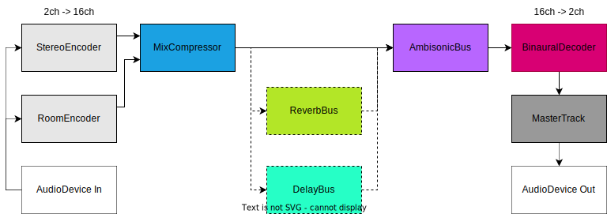
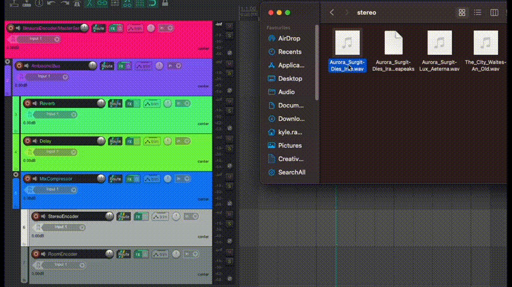
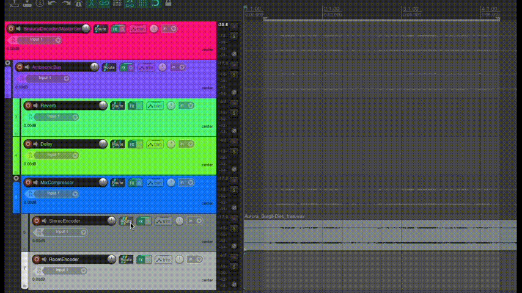
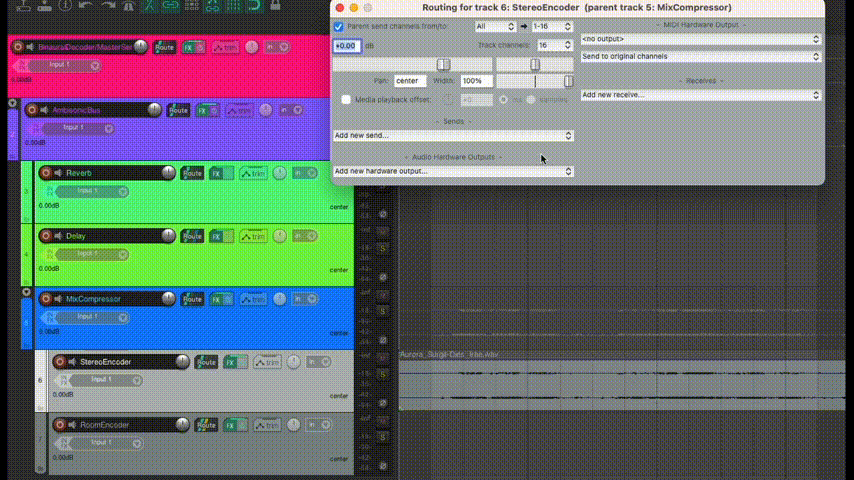
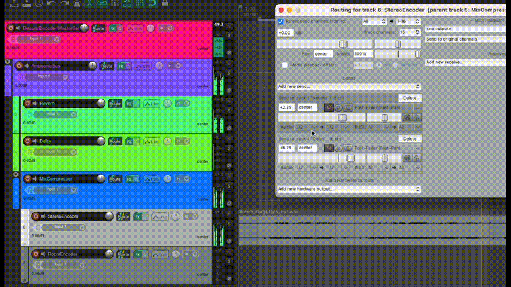

# Reaper templates
 for mixing HOA (Higher Order Ambisonics) at home using headphones (Binaural)
 
 ### Dependencies
 
 + [Reaper](https://www.reaper.fm/download.php)
 + [IEM Plug-in Suite](https://plugins.iem.at/) (check the [documentation](https://plugins.iem.at/docs/installation/) for installation)
 + Over ear headphones

### Project Structure

+ Binaural Decoder/MasterSend (Decodes our b-format ambisonic signal into Binaural and outputted over the Master Track which sends to our headphones)
  + AmbisonicBus (Holds our HOA signal which we can decode/render from)
    + Reverb 
    + Delay
    + MixCompressor
      + StereoEncoder
      + RoomEncoder

### Signal Flow

### Sending Audio to Reverb/Delay Buses

You can either insert audio onto the track by either: 
+ selecting the `RoomEncoder` or `StereoEncoder` Track and going to the taskbar and selecting `Insert` -> `Media File...`.
+ Dragging an audio file onto the track in the timeline as shown below.

Check the track routing and make sure that it's **16 channels** as we are working in **Third-Order-Ambisonics** in this template.

 
If you want to send audio through to the `Reverb` and `Delay` buses, you select the Route 
 

<!--  -->

### TO-DO ###

+ ~~flowchart of signal flow in project.~~
+ ~~some gifs about sending reverb/delay.~~
+ link to accompanying videos onces edited.
+ exporting first & higher ambisonic, and binaural mixes.

