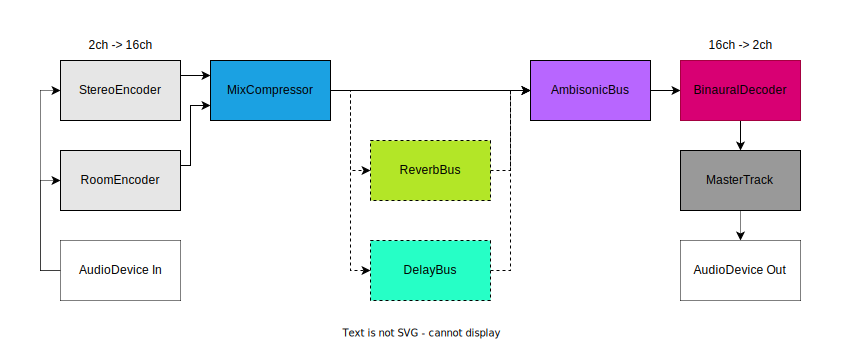
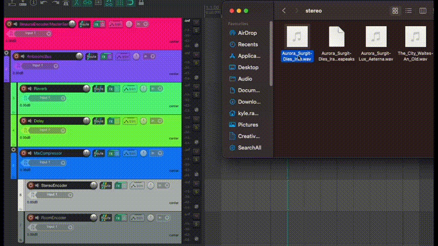
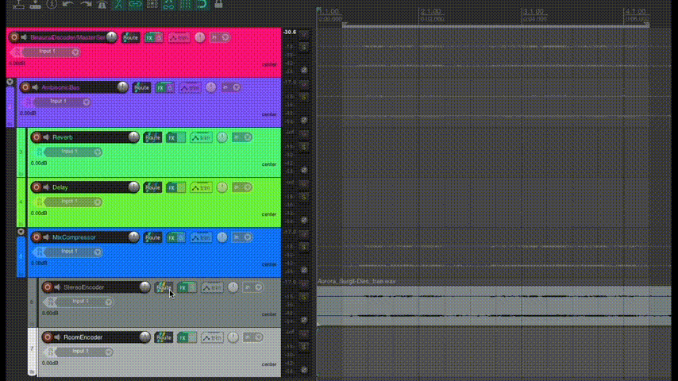
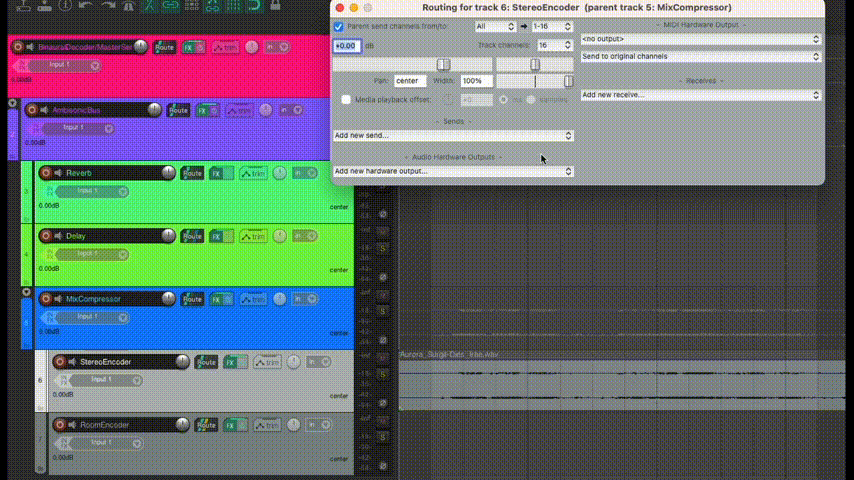
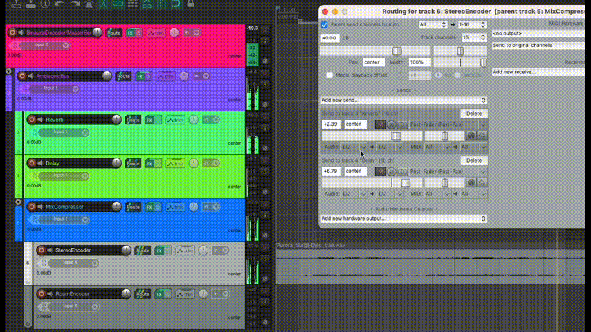
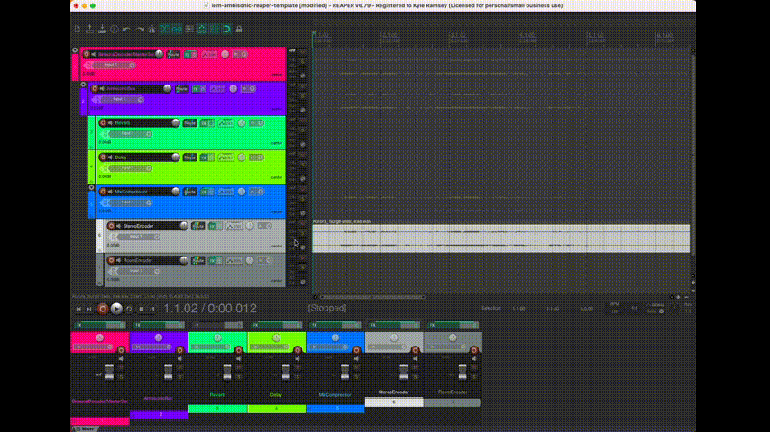
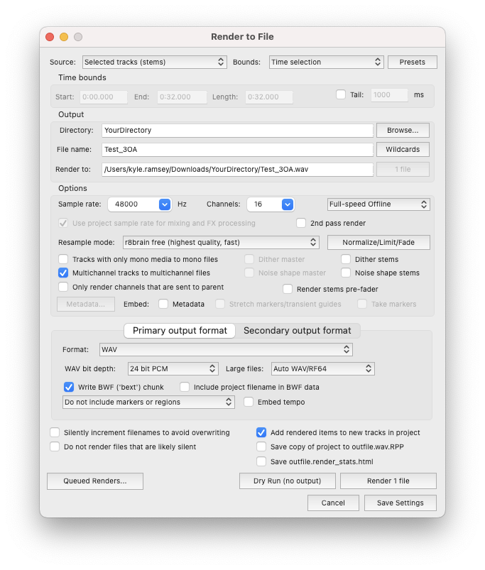

# Reaper template using IEM Plugin Suite
 for mixing HOA (Higher Order Ambisonics) at home using headphones (Binaural)

 ### How to download
There's two ways to download the template you can:
 1. Click on `iem-ambisonic-reaper-template.rpp` to open the file on the git website. Then right-click `Raw` button and select `Save Link As...`.
 2. Right-click on `iem-ambisonic-reaper-template.rpp` then select `Save Link As...`.
 
 ### Dependencies
 
 + [Reaper](https://www.reaper.fm/download.php)
 + [IEM Plug-in Suite](https://plugins.iem.at/) (check the [documentation](https://plugins.iem.at/docs/installation/) for installation)
 + Headphones (open or closed back over-ear headphones preferably)

### Project Structure

+ Binaural Decoder/MasterSend (Decodes our b-format ambisonic signal into Binaural and outputted over the Master Track which sends to our headphones)
  + AmbisonicBus (Holds our HOA signal which we can decode/render from)
    + Reverb 
    + Delay
    + MixCompressor
      + StereoEncoder
      + RoomEncoder

## Signal Flow

Below is a diagram showing how audio signals are passed through each bus.

Key:
+ Straight line = always sending audio.
+ Dashed line = optino to route audio but not by default.
+ Dotted line = conceptual signal send to and from the selected audio device.

  

## Sending Audio to Reverb/Delay Buses

1. You can either insert audio onto the track by either: 
   + selecting the `RoomEncoder` or `StereoEncoder` Track and going to the taskbar and selecting `Insert` -> `Media File...`.
   + Dragging an audio file onto the track in the timeline as shown below.

  

2. Check the track routing and make sure that it's **16 channels** as we are working in **Third-Order-Ambisonics** in this template.

  

1. If you want to send audio through to the `Reverb` and `Delay` buses, you select the Route button then `Add new send`... and select the bus you want to send audio to.

  

4. Make sure that you set the Audio channels from `1/2` to `1/16` so that we are sending all channels through the bus, rather than just the default stereo channels.

  

5. To apply spherical panning to the sound when using IEM's Stereo Encoder plugin, click on the `FX` button on the track.

  

For more info on encoding ambisonic signals check out these resources:
+ [IEM Documentation:Stereo Encoder](https://plugins.iem.at/docs/plugindescriptions/#stereoencoder)
+ [IEM Plugin Suite Youtube Playlist](https://www.youtube.com/watch?v=wTNe4P6sYTg&list=PLLnvq7Y-dSoaEERYb3eIjdj2rJt1tYKL8)
+ [Kenny Gioia on Automation](https://www.youtube.com/watch?v=ckjl-rpzDPA)

## Exporting Audio

Once you are happy with your mix it's now time to export your ambisonic audio track.
How you export your track depends entirely on what software or service you want to play your audio content...

### Third Order Ambisonics
If you are going to be exhibiting your audio to an array of speakers ([see examples here](https://en.wikipedia.org/wiki/Ambisonic_reproduction_systems)) at venues such as IRCAM, IKLECTIK, MONOM, or during exhitions with your own speaker arrays. You are generally going to be want to export in Higher Order Ambisonics (HOA) so that there is enough definition in the ambisonic signal so that it can be reproduced with little chance of artefacts such as comb filtering or phase cancellation ([DOI:10.14279/depositonce-6]()).

To begin exporting your 16 Channel Ambisonic track:
+ Make sure that in all the FX panel on all tracks, that the IEM plugins being used are set to `Auto(3rd)`, and Normalization = `SN3D`
+ All tracks have 16 channels, do this by clicking on the Route button and setting `Track Channels: ` to `16`.
  1. Once above is confirmed, select the Ambisonic Bus. _(If you are using reverb/delay, it's recommended to select a time region before your render so that you it will actually record the release of the effects, otherwise it will stop rendering when the last track clip finishes ([see more details here](https://dlz.reaper.fm/userguide/ReaperUserGuide676d.pdf#%5B%7B%22num%22%3A55147%2C%22gen%22%3A0%7D%2C%7B%22name%22%3A%22XYZ%22%7D%2C108.6%2C721.1%2C0%5D)))_. 
  2. Go `File` -> `Render...`
  3. Adjust your settings as followed:
     + Source: `Selected tracks (stems)`
     + Bounds: `Time selection`
     + Directory: _wherever you want to save your rendered output_
     + File name: _whatever you want to name your rendered output_
     + Sample rate: `48000 Hz` _(CD Quality)_
     + Channels: `16` _(you will need to type in any channel count above 8)_
     + Resample mode: `r8brain free` _(highest quality, fast)_
     + Multichannel tracks to multichannel files: :ballot_box_with_check:
     + Add rendered items to new tracks in project: :ballot_box_with_check:

### First Order Ambisonics (Unity, Unreal, Youtube, etc...)
For most applications which render your Ambisonic track to Binaural such as Unity or Youtube, you will be limited to First Order Ambisonics (FOA). This is only 4 channels so you don't have as much definition as HOA.
You don't need to alter much in our project. In fact, we just need to change our channel count in the Render to File window shown previously.
  1. Same as in [Third Order Ambisonics](#third-order-ambisonics)
  2. Adjust your settings as followed:
      + Channels: `4`

For other ambisonic configurations change the channel count to the following:

| Ambisonic Order 	| Channel Count 	|
|:---:	|:---:	|
| 1st 	| 4 	|
| 2nd 	| 9 	|
| 3rd 	| 16 	|
| 4th 	| 25 	|
| 5th 	| 36 	|
| 6th 	| 49 	|
| 7th 	| 64 	|

  <!-- 1. Ambisonics 1st Order (4 channels)
  1. Ambisonics 2nd Order (9 channels)
  2. Ambisonics 3rd Order (16 channels)
  3. Ambisonics 4th Order (25 channels)
  4. Ambisonics 5th Order (36 channels)
  5. Ambisonics 6th Order (49 channels)
  6. Ambisonics 7th Order (64 Channels) -->

_Reaper & The IEM Plugin Suite supports up to 7th Order Ambisonics_

Increasing our Ambsionic Order is additive, so even through we could be mixing 7th Order Ambisonics, if we just need a 1st Order Ambisonic ttrack after, we can just render out the [first 4 tracks and neglect the rest](http://www.blueripplesound.com/notes/3d_mixing_faq).

Notice the even/odd pattern in the channel counts. This is because we use the equation $(n+1)^2$ to calculate the amount of channels for the ambisonic order we wish to mix in, where _n_ is our channel count

The higher the order, the higher the spatial resolution of the sound, but more resources will be needed, such as CPU and storage.

We choose to use 3rd Order at SpatLab as it's a good middle ground between performance and definition.

### Export Binaural (Anywhere which takes a Stereo Track)

If you want to upload your composition onto Spotify, Soundcloud, or anywhere which excepts stereo audio, you can decode your ambisonic signal to Binaural Format ([Click here]() for further reading on the Binaural format).

We can export directly from the `Master`. If you check the [Project Structure](#project-structure), you can see we have a Binaural Decoder on our main bus which all our audio routes through before going to the master output.

To export our Binaural Stereo Track you do the following
  1. Keep most of the settings the same as in the [Third Order Ambisonics](#third-order-ambisonics)
  2. Adjust your settings as followed:
      + Source: `Master mix`
      + Channels: `Stereo`

## Contributing

If you see anything missing or think there is any examples you would like to add, feel free to open an issue or submit a pull-request :notes:

### TO-DO ###

+ ~~flowchart of signal flow in project.~~
+ ~~some gifs about sending reverb/delay.~~
+ link to accompanying videos onces edited.
+ ~~exporting first & higher ambisonic, and binaural mixes.~~

